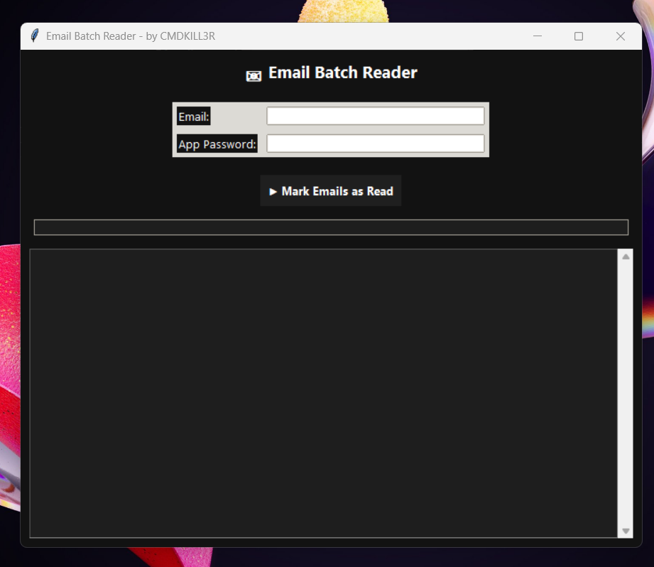
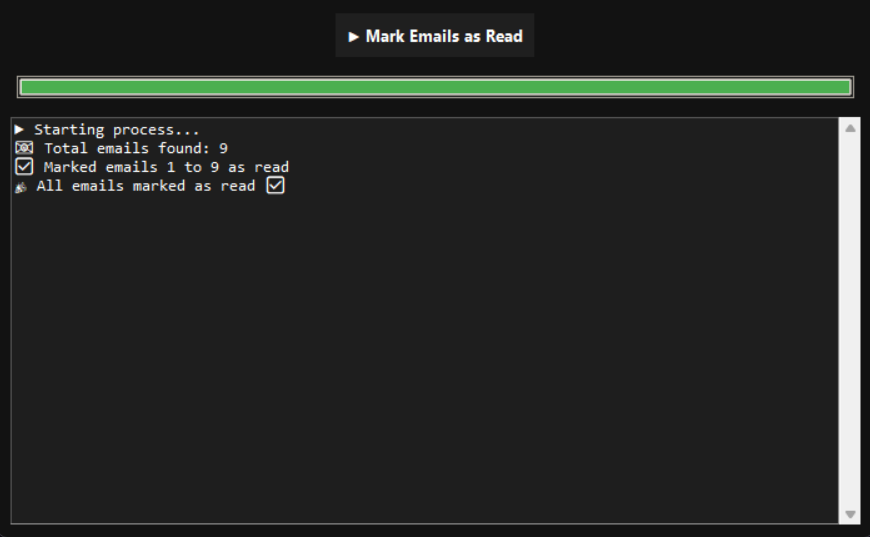

Email Batch Reader  
--

  
  
  

Dark-themed desktop GUI tool to connect to your Gmail inbox and **mark emails as read in batches**.  
Developed with 🖤 by **[CMDKILL3R](https://github.com/cmdkill3r)**.  

---

Features  
--
-  Secure login prompt (email + Gmail App Password)
-  Saves Gmail App Password securely after first use and auto-loads it next time  (python keyring)
-  Scans inbox and counts total emails  
-  Marks emails as read in batches (default: 200 per batch)  
-  Dark-mode GUI with clean hacker aesthetic  
-  Progress bar + live status updates  
-  Log output inside the app + saved to `email_bot.log`  
-  Password is never stored—entered at runtime only  

---

Screenshots  
---

### Main Window  
  

Example Run
-

  
-

---

Installation  
---

1. Clone the repo:  
   ```bash
   git clone https://github.com/cmdkill3r/email-batch-reader.git
   cd email-batch-reader
   ```

Install dependencies (Tkinter comes pre-installed with Python, but make sure you have it.
-

```
pip install -r requirements.txt
```
# Run the tool:
```
python main.py
```
Requirements
-
Python 3.8+

Gmail with IMAP enabled (Settings → Forwarding and POP/IMAP)

Gmail App Password (not your normal password)

Security Notes
-
Your Gmail app password is never stored—only entered in the GUI.

.env, logs, and cache files should be ignored via .gitignore.

Example .gitignore to keep your repo clean:
```
__pycache__/
*.log
*.pyc
*.pyo
```
Author
-
Developed with 🖤 by:
CMDKILL3R
🔗 github.com/cmdkill3r


